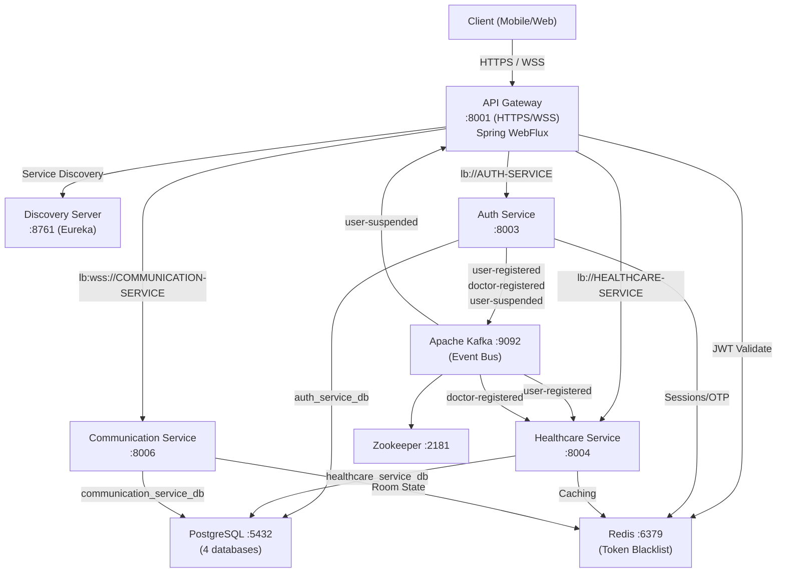

# 🏥 HealthCare Platform

> **A production-grade, cloud-native telemedicine backend** — built as a distributed microservices system enabling patients to connect with doctors, book appointments, conduct real-time video consultations, and manage complete medical records.

[](https://openjdk.org/projects/jdk/21/)
[](https://spring.io/projects/spring-boot)
[](https://spring.io/projects/spring-cloud)
[](https://www.postgresql.org/)
[](https://kafka.apache.org/)
[](https://redis.io/)
[](https://docs.docker.com/compose/)
[](https://stomp.github.io/)
[](LICENSE)

---

## 📑 Table of Contents

1. [Overview](#-overview)
2. [Problem vs Solution](#-problem-vs-solution)
3. [Key Features](#-key-features)
4. [System Architecture](#-system-architecture)
5. [Project Structure](#-project-structure)
6. [Technology Stack](#-technology-stack)
7. [Authentication Flow](#-authentication-flow)
8. [API Reference](#-api-reference)
9. [Database Design](#-database-design)
10. [Installation](#-installation)
11. [Environment Variables](#-environment-variables)
12. [Security](#-security)
13. [Performance](#-performance)
14. [Testing](#-testing)
15. [Deployment](#-deployment)
16. [Future Roadmap](#-future-roadmap)
17. [Contributing](#-contributing)
18. [License](#-license)

---

## 📖 Overview

The **HealthCare Platform** is a backend-only, production-grade telemedicine system designed to connect **patients** with **licensed doctors** through a structured, multi-step workflow: registration → approval → scheduling → appointment booking → real-time video consultation → medical reporting.

### Why This Project Exists

Traditional healthcare systems suffer from fragmented, monolithic architectures that make it difficult to scale individual capabilities independently. This platform solves that by decomposing every concern — authentication, clinical workflows, real-time communication — into dedicated microservices communicating via **Apache Kafka** for event-driven decoupling, while exposing a single hardened entry point through a **reactive API Gateway** backed by **Redis**.

### Target Users

| Role | Capabilities |
|------|-------------|
| **Patient** | Register, browse doctors, request appointments, join video calls, view medical reports |
| **Doctor** | Register with license, manage schedules, accept/reject appointment requests, conduct video consultations, create medical reports |
| **Admin** | Approve/reject doctor registrations, suspend/unsuspend users, manage the entire platform |

### Key Engineering Goals

- **Zero-trust gateway**: every JWT is validated and every suspended user is blocked at the gateway layer before hitting any business service
- **Event-driven profile creation**: Kafka decouples auth from domain, so patient/doctor profiles are created asynchronously without tight coupling
- **Real-time communication**: STOMP over WebSocket for chat and WebRTC signaling for peer-to-peer video calls
- **Idempotent scheduling**: Optimistic locking (`@Version`) on `DoctorSchedule` prevents double-booking race conditions
- **Reactive access control**: the API Gateway is built on Spring WebFlux (reactive), enabling non-blocking JWT + Redis token blacklist checks at scale

---

## 🎯 Problem vs Solution

| Problem | Solution |
|---------|----------|
| Monolithic healthcare apps can't scale individual concerns independently | Each domain (auth, healthcare, communication) is a dedicated microservice |
| Suspended users can still use existing JWT tokens until expiry | Redis-backed token invalidation at the gateway invalidates all sessions instantly |
| No verification that doctors have valid medical licenses | Doctor registration goes through an admin approval workflow with license file upload |
| Double-booking of appointment slots under concurrent load | Optimistic locking (`@Version`) on `DoctorSchedule` prevents race conditions |
| Video consultations require expensive third-party SaaS | WebRTC signaling via STOMP WebSocket enables direct peer-to-peer video, no third-party cost |
| Brute-force attacks on login | Account lockout after 3 failed attempts; auto-unlock after 15 minutes |
| Services need user identity without sharing a database | Gateway extracts JWT claims and injects `X-User-Id`, `X-Username`, `X-User-Roles` headers into every downstream request |
| Patient/doctor profiles spread across services risk data inconsistency | Kafka events (`user-registered`, `doctor-registered`) drive eventual consistency between auth and healthcare databases |

---

## ✨ Key Features

### 1. Role-Based Registration with Admin Approval Workflow

**Business Value:** Ensures only verified, licensed doctors can practice on the platform.

**Technical Implementation:** Patient registration is immediate — the user is created in `auth_service_db`, a `user-registered` Kafka event is published, and the healthcare-service consumes it to create a `PatientProfile`. Doctor registration is a two-phase process: the application (with license file upload) is saved as a `DoctorRequest` in `PENDING` state. When an admin approves, the auth service atomically creates the `AppUser`, upgrades the role to `ROLE_DOCTOR`, sends an approval email, and publishes a `doctor-registered` Kafka event which the healthcare-service consumes to create a `DoctorProfile`.

**Example Flow:**
```
POST /api/register/doctor (multipart: license file, credentials)
→ DoctorRequest saved (PENDING)
→ Admin: POST /api/admin/doctor-requests/{id}/approve
→ AppUser created with ROLE_DOCTOR
→ Kafka: doctor-registered event published
→ healthcare-service: DoctorProfile created automatically
→ Email sent to doctor
```

---

### 2. Real-Time Video Consultation via WebRTC

**Business Value:** Enables remote consultations without any third-party video service cost.

**Technical Implementation:** The communication-service implements a full WebRTC signaling server over STOMP WebSocket. When both participants join (`JOIN` signal), the signaling server stores room state in-memory and orchestrates the WebRTC handshake: `OFFER` → `ANSWER` → `ICE_CANDIDATE` exchange. The gateway proxies WebSocket connections (`lb:wss://COMMUNICATION-SERVICE`), and JWT authentication is enforced at the WebSocket handshake level via `JwtHandshakeInterceptor` and at the STOMP message level via `AuthChannelInterceptor`. STUN/TURN server configuration is served from `/api/communication/webrtc/ice-servers`.

**Example Flow:**
```
WS Connect → /ws (JWT validated via JwtHandshakeInterceptor)
STOMP: /app/webrtc.signal { type: JOIN, appointmentId: 123 }
→ Room created in-memory; second participant joins
STOMP: /app/webrtc.signal { type: OFFER, sdp: ... }
→ Forwarded to /topic/appointment/123
STOMP: /app/webrtc.signal { type: ANSWER, sdp: ... }
→ WebRTC peer connection established (P2P)
```

---

### 3. Instant Token Invalidation on User Suspension

**Business Value:** Admins can immediately revoke access for suspended accounts, a critical security capability.

**Technical Implementation:** When an admin suspends a user, `AdminUserService` sets `active=false`, writes a `tokenInvalidatedAt` timestamp, then publishes a `UserSuspendedEvent` to the `user-suspended` Kafka topic. The API Gateway has a Kafka consumer (`UserSuspendedConsumer`) that writes the invalidation timestamp to Redis (`user:{userId}:invalidatedAt`). The `AuthenticationFilter` (WebFlux) checks Redis on every authenticated request and rejects any JWT whose `iat` (issued-at) is earlier than the Redis timestamp. This means all existing tokens are invalidated within milliseconds — no waiting for JWT expiry.

---

### 4. Appointment Booking with State Machine

**Business Value:** Prevents invalid status transitions (e.g., jumping from `PENDING` to `COMPLETED`) which would corrupt the audit trail.

**Technical Implementation:** `AppointmentStatusTransition` implements a state machine that validates allowed transitions before any update. A patient creates an `AppointmentRequest` (PENDING). The doctor accepts or rejects via `PATCH /api/appointment-requests/doctor/{id}/status`. On `APPROVED`, `AppointmentApprovalService` atomically creates an `Appointment`, locks the schedule slot (`isLocked=true`), generates a `meetingToken`, and stores it on the appointment. The unique constraint on `(patient_id, doctor_id, date, start_time)` prevents duplicate requests at the database level.

---

### 5. Role-Stratified Dashboards with Analytics

**Business Value:** Each user type sees business-relevant KPIs without accessing each other's data.

**Technical Implementation:** Three separate dashboard endpoints (`/api/dashboard/admin`, `/api/dashboard/doctor`, `/api/dashboard/patient`) enforce role-based access at both the API Gateway (Spring Security `hasRole`) and controller level. The admin dashboard aggregates `totalAppointmentsToday`, `totalDoctors`, `totalPatients`, and `pendingDoctorApprovals`. The doctor dashboard supports time-range analytics (weekly/monthly/yearly) via the **Strategy Pattern** — `AppointmentStrategyRegistry` maps a `range` query parameter to the appropriate `AppointmentRangeStrategy` implementation, making it trivially extensible.

---

## 🏗 System Architecture



### Architecture Classification: **Microservices with Event-Driven Integration**

This is a **microservices architecture** with event-driven decoupling via Apache Kafka. Each service owns its own database (Database-per-Service pattern), communicates synchronously through the API Gateway via Netflix Eureka service discovery, and integrates asynchronously through Kafka events for cross-service domain synchronization.

| Service | Responsibility | Pattern |
|---------|---------------|---------|
| `api-gateway` | Single ingress, JWT validation, routing, rate-limiting via Redis | Reactive Gateway (WebFlux) |
| `discovery-server` | Service registry; all services self-register on startup | Eureka Server |
| `auth-service` | Identity, credentials, roles, doctor approval, password management | Layered MVC |
| `healthcare-service` | Clinical domain: profiles, schedules, appointments, reports, medicines | Domain-oriented modules |
| `communication-service` | Real-time chat + WebRTC signaling over STOMP/WebSocket | Event-driven Messaging |

---
