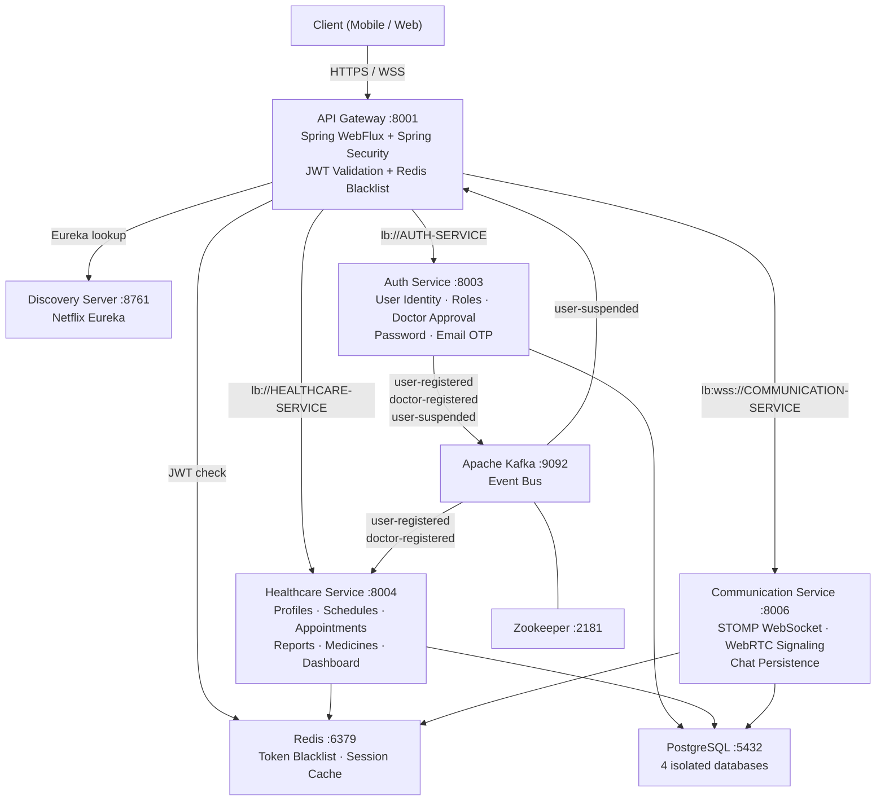
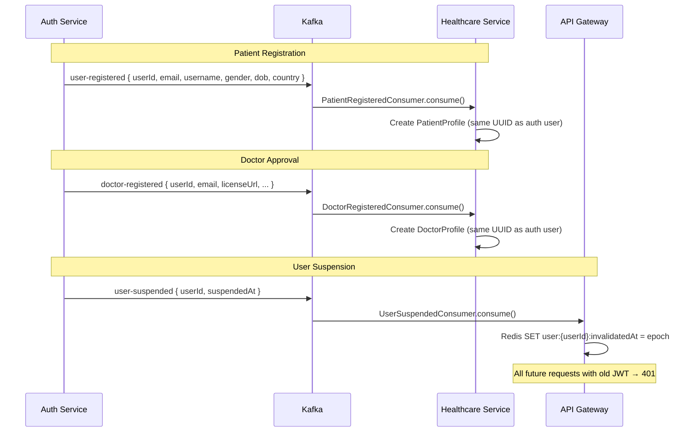

# HealthCare Platform

**Microservices-based telemedicine backend demonstrating event-driven communication, JWT security, real-time video consultation, and distributed service orchestration.**

[](https://openjdk.org/projects/jdk/21/)
[](https://spring.io/projects/spring-boot)
[](https://spring.io/projects/spring-cloud)
[](https://www.postgresql.org/)
[](https://kafka.apache.org/)
[](https://redis.io/)
[](https://docs.docker.com/compose/)
[](LICENSE)

---

## 📑 Table of Contents

1. [Overview](#-overview)
2. [Project Metrics](#-project-metrics)
3. [Problem vs Solution](#-problem-vs-solution)
4. [Key Features](#-key-features)
5. [System Architecture](#-system-architecture)
6. [Authentication Flow](#-authentication-flow)
7. [Event Flow (Kafka)](#-event-flow-kafka)
8. [Project Structure](#-project-structure)
9. [Technology Stack](#-technology-stack)
10. [API Reference](#-api-reference)
11. [Database Design](#-database-design)
12. [Installation](#-installation)
13. [Environment Variables](#-environment-variables)
14. [Design Decisions](#-design-decisions)
15. [Challenges Solved](#-challenges-solved)
16. [Security](#-security)
17. [Deployment](#-deployment)
18. [Future Roadmap](#-future-roadmap)
19. [What I Learned](#-what-i-learned)
20. [Contributing](#-contributing)
21. [License](#-license)

---

## 📖 Overview

The HealthCare Platform is a backend-only telemedicine system that enables patients to connect with licensed doctors through a structured workflow: registration → admin approval → schedule management → appointment booking → real-time video consultation → medical reporting.

The system is structured as five independently deployable microservices communicating through Apache Kafka for domain event propagation, exposed via a single reactive API Gateway backed by Redis for instant token invalidation.

**Target users:** patients seeking remote consultations, doctors managing schedules and appointments, and platform admins verifying credentials and managing accounts.

---

## 📊 Project Metrics

| Metric | Value |
|--------|-------|
| Microservices | 5 (gateway, discovery, auth, healthcare, communication) |
| REST API Endpoints | 70+ |
| Kafka Topics | 4 (`user-registered`, `doctor-registered`, `user-suspended`, `user-unsuspended`) |
| Database Tables | 12+ across 4 separate PostgreSQL databases |
| Docker Containers | 9 (postgres, redis, zookeeper, kafka, + 5 services) |
| WebSocket Endpoints | 2 (`/app/chat.send`, `/app/webrtc.signal`) |
| User Roles | 3 (`ROLE_PATIENT`, `ROLE_DOCTOR`, `ROLE_ADMIN`) |
| Java Version | 21 (virtual threads ready) |
| Spring Boot Version | 3.2.11 |

---

## 🎯 Problem vs Solution

| Problem | Solution |
|---------|----------|
| Cannot independently scale auth vs clinical workloads | Database-per-service pattern; each service scales independently |
| Suspended users continue using existing JWTs until expiry | Kafka event → Redis blacklist at gateway; all tokens invalidated in milliseconds |
| No way to verify doctor credentials at registration | Two-phase doctor registration: license upload → admin review → account creation |
| Double-booking under concurrent appointment requests | `@Version` optimistic locking on `DoctorSchedule`; unique DB constraint on `(patient_id, doctor_id, date, start_time)` |
| Video consultation requires expensive third-party SaaS | In-house WebRTC signaling server over STOMP WebSocket |
| Services need user identity without sharing a database | Gateway extracts JWT claims and injects `X-User-Id`, `X-Username`, `X-User-Roles` headers |
| Brute-force login attacks | Account lockout after 3 failures; auto-unlock after 15 minutes |
| Profile creation across services risks tight coupling | Kafka events drive eventual consistency; healthcare-service creates profiles independently |

---

## ✨ Key Features

### 1. Doctor Registration with Admin Approval
Patient registration is immediate. Doctor registration is a two-phase workflow: submit credentials + medical license file → saved as `DoctorRequest (PENDING)` → admin reviews via dashboard → on approval, `AppUser` is created with `ROLE_DOCTOR`, approval email is sent, and a `doctor-registered` Kafka event triggers automatic `DoctorProfile` creation in the healthcare-service.

### 2. Real-Time Video Consultation (WebRTC)
The communication-service implements a WebRTC signaling server over STOMP WebSocket. Signal types `JOIN`, `OFFER`, `ANSWER`, `ICE`, `LEAVE` are handled by `WebRtcSignalingController`. JWT authentication is enforced at both the WebSocket handshake (`JwtHandshakeInterceptor`) and STOMP message level (`AuthChannelInterceptor`). Google STUN and OpenRelay TURN servers are served from `/api/communication/webrtc/ice-servers`.

### 3. Instant Token Invalidation on Suspension
When an admin suspends a user: `active=false` is set, a `UserSuspendedEvent` is published to Kafka. The API Gateway's `UserSuspendedConsumer` writes a `tokenInvalidatedAt` timestamp to Redis. The reactive `AuthenticationFilter` checks Redis on every authenticated request and rejects JWTs with `iat < invalidatedAt`. Unsuspension removes the Redis key, instantly restoring access.

### 4. Appointment Booking with State Machine
Patients request appointment slots. Doctors accept or reject via `PATCH /api/appointment-requests/doctor/{id}/status`. `AppointmentStatusTransition` validates every state transition before applying it. On `APPROVED`, `AppointmentApprovalService` atomically creates an `Appointment`, locks the schedule slot, and generates a `meetingToken` for WebRTC room access.

### 5. Role-Stratified Dashboards with Time-Range Analytics
Three separate dashboard endpoints enforce role-based access. The doctor dashboard supports pluggable time-range analytics (weekly/monthly/yearly) via the **Strategy Pattern** — `AppointmentStrategyRegistry` maps a `range` query param to the correct `AppointmentRangeStrategy` implementation, making new time ranges trivially addable without modifying existing code.

### 6. Persistent In-Appointment Chat
`ChatController` handles STOMP messages at `/app/chat.send`, persists every message to `ChatMessage` in PostgreSQL, then broadcasts to `/topic/appointment/{id}`. Chat history is retrievable via `GET /api/communication/appointments/{id}/messages`.

### 7. Medical Reporting with Prescription Management
Doctors create `MedicalReport` records linked to appointments. Reports contain diagnosis, symptoms, treatment plan, and a list of prescribed `ReportMedicine` entries. Reports go through a draft → finalized lifecycle (`PATCH /api/reports/{id}/finalize`). Patients and doctors each have scoped endpoints to fetch only their relevant reports.

---

## 🏗 System Architecture



| Service | Port | Role |
|---------|------|------|
| `api-gateway` | 8001 | Single ingress (HTTPS + WSS), JWT auth, load-balanced routing |
| `discovery-server` | 8761 | Eureka service registry |
| `auth-service` | 8003 | Identity, credentials, doctor approval, OTP/email |
| `healthcare-service` | 8004 | Clinical domain: profiles, schedules, appointments, reports |
| `communication-service` | 8006 | Real-time chat and WebRTC video signaling |

---

## 🔐 Authentication Flow

### Login Sequence

```
Client                 Gateway              Auth Service          Redis
  │                       │                      │                  │
  │── POST /api/auth/login-web ──────────────────>│                  │
  │                       │                      │                  │
  │                       │  (public path,        │                  │
  │                       │   no JWT check)       │                  │
  │                       │                      │                  │
  │                       │──── forward ─────────>│                  │
  │                       │                      │                  │
  │                       │            BCrypt verify password        │
  │                       │            Check failedAttempts          │
  │                       │            Check accountLocked           │
  │                       │                      │                  │
  │                       │            Sign JWT (RS256)              │
  │                       │            claims: id, username,         │
  │                       │            email, roles, iat, exp        │
  │                       │                      │                  │
  │<─── 200 { token } ───────────────────────────│                  │
```

### Authenticated Request Sequence

```
Client                 Gateway (WebFlux)          Redis          Downstream
  │                       │                         │               │
  │── GET /api/... ───────>│                         │               │
  │   Authorization: Bearer <jwt>                   │               │
  │                       │                         │               │
  │                       │ 1. Extract JWT           │               │
  │                       │ 2. Validate RS256 sig    │               │
  │                       │ 3. Parse claims          │               │
  │                       │                         │               │
  │                       │── GET user:{id}:invalidatedAt ─────────>│
  │                       │<─────────────────────────│               │
  │                       │                         │               │
  │                       │ 4. If iat < invalidatedAt → 401         │
  │                       │ 5. Strip spoofed X-User headers         │
  │                       │ 6. Inject verified:                     │
  │                       │    X-User-Id, X-Username, X-User-Roles  │
  │                       │                         │               │
  │                       │────────── forward mutated request ──────>│
  │<── 200 response ──────────────────────────────────────────────── │
```

### Forgot Password / OTP Flow

```
Client                       Auth Service                    Email
  │                               │                            │
  │── POST /api/auth/forget-password ──────────────────────────│
  │   { email }                   │                            │
  │                       Generate OTP token                   │
  │                       Store in user.resetToken             │
  │                       Set tokenExpiry                      │
  │                               │── Send OTP email ─────────>│
  │<── 200 "OTP sent to email" ───│                            │
  │                               │                            │
  │── POST /api/auth/verify-reset-token ──────────────────────>│
  │   { email, token }            │                            │
  │                    Validate token + expiry                 │
  │<── 200 "Token is valid" ──────│                            │
  │                               │                            │
  │── POST /api/auth/reset-password ──────────────────────────>│
  │   { email, token, newPassword}│                            │
  │                    BCrypt encode new password               │
  │                    Clear resetToken                        │
  │<── 200 "Password reset successfully" ─────────────────────│
```

---

## 📨 Event Flow (Kafka)



**Topic Summary:**

| Topic | Producer | Consumer | Purpose |
|-------|----------|----------|---------|
| `user-registered` | auth-service | healthcare-service | Auto-create PatientProfile |
| `doctor-registered` | auth-service | healthcare-service | Auto-create DoctorProfile |
| `user-suspended` | auth-service | api-gateway | Write Redis token blacklist |

---

## 📁 Project Structure

```
healthcare/                          ← Monorepo root (git submodules)
├── .env                             ← Shared environment variables
├── docker-compose.yml               ← Full stack: all services + infra
├── init.sql                         ← Creates 4 PostgreSQL databases on startup
├── .gitmodules                      ← Each service is an independent git submodule
│
├── api-gateway/                     ← Spring WebFlux reactive gateway
│   └── src/main/java/
│       ├── filter/
│       │   └── AuthenticationFilter.java   ← JWT validation + Redis blacklist check
│       ├── configs/
│       │   ├── SecurityConfig.java         ← WebFlux security + role-based path rules
│       │   ├── RedisConfig.java            ← ReactiveStringRedisTemplate
│       │   └── CorsConfig.java
│       ├── consumer/
│       │   └── UserSuspendedConsumer.java  ← Kafka → Redis blacklist writer
│       └── util/
│           ├── JwtUtil.java                ← RS256 JWT parser
│           └── JwtKeyUtil.java             ← RSA public key loader from keystore
│
├── auth-service/                    ← Spring MVC identity service
│   └── src/main/java/
│       ├── controller/              ← AuthsController, RegistrationController,
│       │                               PasswordController, AdminUserController,
│       │                               DoctorRequestController
│       ├── service/                 ← AuthsService, RegistrationService,
│       │                               DoctorRequestService, AdminUserService,
│       │                               PasswordService, LoginAttemptService, EmailService
│       ├── model/                   ← AppUser (implements UserDetails), Role, DoctorRequest
│       ├── config/
│       │   ├── JwtTokenProvider.java       ← RS256 JWT generation
│       │   ├── JwtAuthenticationFilter.java← Per-request JWT extraction in auth-service
│       │   ├── SecurityConfig.java         ← Stateless session, BCrypt, filter chain
│       │   └── AdminDataInitializer.java   ← Seeds admin user on startup
│       └── event/                   ← UserRegisteredEvent, DoctorRegisteredEvent,
│                                       UserSuspendedEvent (Kafka payloads)
│
├── healthcare-service/              ← Clinical domain service (domain-oriented modules)
│   └── src/main/java/
│       ├── patient/                 ← PatientProfile CRUD + Kafka consumer
│       ├── doctor/                  ← DoctorProfile + DoctorSchedule + Kafka consumer
│       ├── appointment/             ← Appointment lifecycle (patient/doctor/admin views)
│       ├── appointmentRequest/      ← Request → Approval → Appointment state machine
│       ├── report/                  ← MedicalReport + ReportMedicine management
│       ├── medicine/                ← Medicine catalog
│       ├── dashboard/               ← Role-specific dashboards with analytics
│       └── common/                  ← Shared DTOs, exceptions, strategy pattern, utils
│
├── communication-service/           ← Real-time service
│   └── src/main/java/
│       ├── controller/
│       │   ├── ChatController.java         ← STOMP /app/chat.send + REST history
│       │   └── WebRtcSignalingController.java ← JOIN/OFFER/ANSWER/ICE/LEAVE signals
│       ├── config/
│       │   ├── StompWebSocketConfig.java   ← STOMP broker, /ws endpoint
│       │   ├── AuthChannelInterceptor.java ← JWT auth at STOMP message level
│       │   └── JwtHandshakeInterceptor.java← JWT auth at WS handshake level
│       ├── service/
│       │   ├── ChatService.java            ← Persist + broadcast messages
│       │   └── WebRtcRoomService.java      ← In-memory room state management
│       └── model/                   ← ChatMessage, CallRoom, MessageType
│
└── discovery-server/                ← Netflix Eureka registry (single class)
```

---

## 🛠 Technology Stack

### Backend
| Technology | Version | Purpose |
|-----------|---------|---------|
| Java | 21 | Primary language |
| Spring Boot | 3.2.11 | Application framework |
| Spring WebFlux | 3.2.11 | Reactive API Gateway |
| Spring Security | 6.x | Authentication and authorization |
| Spring Data JPA | 3.2.11 | ORM for PostgreSQL |
| Spring Kafka | 3.x | Kafka producer/consumer |
| Spring Mail | 3.2.11 | SMTP email (OTP, notifications) |
| Spring Cloud Gateway | 2023.0.3 | Routing and load balancing |
| Netflix Eureka | 2023.0.3 | Service discovery and registry |
| OpenFeign | 2023.0.3 | Declarative HTTP client (auth→healthcare) |
| JJWT | 0.11.5 | RS256 JWT generation and validation |
| Lombok | 1.18.30 | Boilerplate reduction |
| MapStruct (mapper) | — | DTO ↔ Entity mapping |

### Infrastructure
| Technology | Version | Purpose |
|-----------|---------|---------|
| PostgreSQL | 15 | Primary relational database (4 isolated DBs) |
| Redis | 7 | Token blacklist, reactive caching |
| Apache Kafka | 7.5.0 | Async event bus between services |
| Zookeeper | 7.5.0 | Kafka coordination |
| Docker + Compose | — | Container orchestration |

### Communication
| Technology | Purpose |
|-----------|---------|
| STOMP over WebSocket | Real-time chat between doctor and patient |
| WebRTC (browser P2P) | Video consultation; signaling via STOMP |
| HTTP/REST | All standard API interactions |
| HTTPS (PKCS12 keystore) | TLS termination at the gateway |

### Security
| Technology | Purpose |
|-----------|---------|
| RS256 (RSA-256) | Asymmetric JWT signing; private key in auth-service, public key in gateway |
| BCrypt | Password hashing |
| Redis Blacklist | Instant token invalidation on suspension |
| Spring Security RBAC | Role-based path protection at gateway and service level |


---

## 📡 API Reference

### Auth Service (`/api/auth`, `/api/register`)

| Method | Endpoint | Auth | Description |
|--------|----------|------|-------------|
| `POST` | `/api/register/patient` | Public | Register a new patient account |
| `POST` | `/api/register/doctor` | Public | Submit doctor registration request with license file |
| `POST` | `/api/auth/login-web` | Public | Login; returns JWT token |
| `POST` | `/api/auth/logout` | Public | Clears session cookie |
| `GET` | `/api/auth/me` | JWT | Get current authenticated user profile |
| `POST` | `/api/auth/forget-password` | Public | Send OTP to email for password reset |
| `POST` | `/api/auth/verify-reset-token` | Public | Validate OTP token |
| `POST` | `/api/auth/reset-password` | Public | Reset password using OTP token |
| `PUT` | `/api/auth/change-password` | JWT | Change password (authenticated user) |

### Admin — User Management (`/api/admin/users`)

| Method | Endpoint | Auth | Description |
|--------|----------|------|-------------|
| `GET` | `/api/admin/users` | ADMIN | Paginated list of all users |
| `GET` | `/api/admin/users/{id}` | ADMIN | Get single user by UUID |
| `DELETE` | `/api/admin/users/{id}` | ADMIN | Delete user permanently |
| `PUT` | `/api/admin/users/{id}/role` | ADMIN | Change user role |
| `GET` | `/api/admin/users/gender-count` | ADMIN | User count grouped by gender |
| `POST` | `/api/admin/users/{id}/suspend` | ADMIN | Suspend user (invalidates all tokens instantly) |
| `POST` | `/api/admin/users/{id}/unsuspend` | ADMIN | Restore user access |

### Admin — Doctor Requests (`/api/admin/doctor-requests`)

| Method | Endpoint | Auth | Description |
|--------|----------|------|-------------|
| `GET` | `/api/admin/doctor-requests` | ADMIN | All doctor registration requests |
| `GET` | `/api/admin/doctor-requests/pending` | ADMIN | Only PENDING requests |
| `GET` | `/api/admin/doctor-requests/pending-count` | ADMIN | Count of pending requests |
| `POST` | `/api/admin/doctor-requests/{id}/approve` | ADMIN | Approve → create account + publish Kafka event |
| `POST` | `/api/admin/doctor-requests/{id}/reject` | ADMIN | Reject → send rejection email |

### Healthcare — Profiles

| Method | Endpoint | Auth | Description |
|--------|----------|------|-------------|
| `GET` | `/api/patient-profiles` | PATIENT/ADMIN | Get own patient profile |
| `PUT` | `/api/patient-profiles` | PATIENT | Update own patient profile |
| `GET` | `/api/admin/patients` | ADMIN | All patient profiles (paginated) |
| `GET` | `/api/doctor-profiles/{id}` | JWT | Get doctor profile by ID |
| `PUT` | `/api/doctor-profiles` | DOCTOR | Update own doctor profile |
| `GET` | `/api/admin/doctors` | ADMIN | All doctor profiles (paginated) |

### Healthcare — Schedules

| Method | Endpoint | Auth | Description |
|--------|----------|------|-------------|
| `POST` | `/api/schedules/weekly` | DOCTOR | Create weekly schedule slots |
| `GET` | `/api/schedules` | DOCTOR | Get own schedule |
| `GET` | `/api/schedules/{doctorId}` | JWT | Get a doctor's schedule (for booking) |
| `PUT` | `/api/schedules/{scheduleId}` | DOCTOR | Update a schedule slot |
| `DELETE` | `/api/schedules/{scheduleId}` | DOCTOR | Delete a schedule slot |

### Healthcare — Appointment Requests

| Method | Endpoint | Auth | Description |
|--------|----------|------|-------------|
| `POST` | `/api/appointment-requests` | PATIENT | Create appointment request |
| `GET` | `/api/appointment-requests/patient` | PATIENT | Patient's outgoing requests |
| `GET` | `/api/appointment-requests/doctor` | DOCTOR | Doctor's incoming requests |
| `PATCH` | `/api/appointment-requests/doctor/{id}/status` | DOCTOR | Accept or reject request |

### Healthcare — Appointments

| Method | Endpoint | Auth | Description |
|--------|----------|------|-------------|
| `GET` | `/api/appointments/doctor/upcoming` | DOCTOR | Upcoming appointments |
| `GET` | `/api/appointments/doctor` | DOCTOR | All appointments (paginated) |
| `GET` | `/api/appointments/doctor/history` | DOCTOR | Past appointments (paginated) |
| `GET` | `/api/appointments/doctor/range?range=weekly` | DOCTOR | Appointments by time range |
| `GET` | `/api/appointments/doctor/checkup-count` | DOCTOR | Breakdown by checkup type |
| `GET` | `/api/appointments/patient/upcoming` | PATIENT | Upcoming appointments |
| `GET` | `/api/appointments/patient` | PATIENT | All appointments (paginated) |
| `GET` | `/api/appointments/patient/history` | PATIENT | Past appointments (paginated) |
| `GET` | `/api/appointments/patient/status-count` | PATIENT | Count by status |
| `GET` | `/api/appointments/{id}/access?token=` | JWT | Validate meeting token for WebRTC access |

### Healthcare — Reports & Medicines

| Method | Endpoint | Auth | Description |
|--------|----------|------|-------------|
| `POST` | `/api/reports` | DOCTOR | Create medical report for appointment |
| `PUT` | `/api/reports/{id}` | DOCTOR | Update report (draft stage) |
| `PATCH` | `/api/reports/{id}/finalize` | DOCTOR | Finalize and lock report |
| `GET` | `/api/reports/patient` | PATIENT | Patient's own medical reports |
| `GET` | `/api/reports/doctor` | DOCTOR | Reports created by doctor |
| `GET` | `/api/reports/appointment/{appointmentId}` | JWT | Report for specific appointment |
| `POST` | `/api/medicines` | DOCTOR | Add medicine to catalog |
| `GET` | `/api/medicines` | JWT | List all medicines |

### Healthcare — Dashboards

| Method | Endpoint | Auth | Description |
|--------|----------|------|-------------|
| `GET` | `/api/dashboard/admin/stats` | ADMIN | Total appointments today, doctors, patients, pending approvals |
| `GET` | `/api/dashboard/admin/weekly-appointments` | ADMIN | Weekly appointment trend |
| `GET` | `/api/dashboard/doctor/stats` | DOCTOR | Doctor-specific KPIs |
| `GET` | `/api/dashboard/patient/stats` | PATIENT | Patient-specific KPIs |

### Communication Service

| Method | Endpoint | Auth | Description |
|--------|----------|------|-------------|
| `GET` | `/api/communication/appointments/{id}/messages` | JWT | Retrieve chat history for appointment |
| `GET` | `/api/communication/webrtc/ice-servers` | JWT | STUN/TURN server configuration |
| `WS` | `/ws` (STOMP) | JWT (handshake) | WebSocket connection endpoint |
| `STOMP` | `/app/chat.send` | JWT (interceptor) | Send chat message |
| `STOMP` | `/app/webrtc.signal` | JWT (interceptor) | Send WebRTC signal (JOIN/OFFER/ANSWER/ICE/LEAVE) |

---

## 🗄 Database Design

### Entity Relationship Summary

```
auth_service_db
├── users (AppUser)         UUID PK, username UNIQUE, email UNIQUE,
│                           password(BCrypt), gender, dob, country, active,
│                           failedAttempts, accountLocked, lockTime,
│                           resetToken, tokenExpiry, tokenInvalidatedAt,
│                           suspendReason, createdAt
├── roles                   BIGINT PK, name (ROLE_ADMIN|ROLE_DOCTOR|ROLE_PATIENT)
├── user_roles              FK(user_id) + FK(role_id)  [M:N join table]
└── doctor_request          BIGINT PK, username, email, password(BCrypt),
                            doctorLicence (file path), gender, dob, country,
                            status (PENDING|APPROVED|REJECTED)

healthcare_service_db
├── patient_profiles        UUID PK (same as auth user UUID), fullName, email,
│                           contactNumber, profileImage, dob, gender, country,
│                           status (createdAt, updatedAt via BaseEntity)
├── doctor_profiles         UUID PK (same as auth user UUID), fullName, email,
│                           specialization, yearsOfExperience, workingAt,
│                           contactNumber, dob, gender, country, profileImage,
│                           status
├── doctor_schedules        BIGINT PK, FK(doctor_id), scheduleDate, startTime,
│                           endTime, available, isLocked, version (optimistic lock)
│                           UNIQUE(doctor_id, scheduleDate, startTime)
├── appointment_requests    BIGINT PK, patientId, patientFullName, doctorId,
│                           doctorFullName, date, startTime, endTime,
│                           status (PENDING|APPROVED|REJECTED|CANCELLED), notes
│                           UNIQUE(patient_id, doctor_id, date, start_time)
├── appointments            BIGINT PK, FK(doctor_id→doctor_profiles),
│                           FK(patient_id→patient_profiles),
│                           FK(schedule_id→doctor_schedules),
│                           FK(appointment_request_id) UNIQUE,
│                           appointmentDate, meetingLink, meetingToken,
│                           status (PENDING|CONFIRMED|COMPLETED|CANCELLED),
│                           checkupType
├── medical_reports         BIGINT PK, FK(appointment_id) 1:1, patientId, doctorId,
│                           title, diagnosis, symptoms, treatmentPlan, notes,
│                           reportType, status, reportUrl, finalizedAt
├── report_medicines        BIGINT PK, FK(medical_report_id), medicineId, dosage,
│                           frequency, duration, notes
└── medicines               BIGINT PK, name, description, dosage, category,
                            sideEffects, manufacturer, addedByDoctorId

communication_service_db
└── chat_messages           BIGINT PK, appointmentId, senderId, content,
                            messageType, timestamp
```

### Key Relationships

- `AppUser` UUID is propagated via Kafka events and used as the primary key of `PatientProfile` / `DoctorProfile` — eliminating any need for cross-service JOINs
- `DoctorSchedule` has a `@Version` field for optimistic locking — concurrent booking attempts result in `OptimisticLockingFailureException` rather than silent double-booking
- `Appointment` references `AppointmentRequest` with a UNIQUE constraint — one request can produce exactly one appointment
- `MedicalReport` has a 1:1 `@OneToOne` with `Appointment` — one appointment → one report

---

## 🚀 Installation

### Prerequisites

- Java 21+
- Docker & Docker Compose
- Git with submodule support

### 1. Clone with Submodules

```bash
git clone --recurse-submodules https://github.com/shroyash/healthcare-system.git
cd healthcare-system
```

If already cloned without submodules:

```bash
git submodule update --init --recursive
```

### 2. Configure Environment

Copy and edit the environment file:

```bash
cp .env.example .env
# Edit .env with your values (see Environment Variables section)
```

### 3. Start Full Stack with Docker Compose

```bash
docker compose up --build
```

Services start in dependency order enforced by healthchecks:
1. PostgreSQL, Redis, Zookeeper
2. Kafka (waits for Zookeeper healthy)
3. Discovery Server (waits for Kafka healthy)
4. API Gateway, Auth Service, Healthcare Service, Communication Service (wait for Discovery Server healthy)

### 4. Verify Services

| Service | URL |
|---------|-----|
| API Gateway | https://localhost:8001 |
| Eureka Dashboard | http://localhost:8761 |
| Auth Service | http://localhost:8003/actuator/health |
| Healthcare Service | http://localhost:8004/actuator/health |
| Communication Service | http://localhost:8006/actuator/health |

### 5. Default Admin Account

Seeded automatically on auth-service startup:

```
Username: admin
Password: Admin@123
Email:    admin@example.com
```

> ⚠️ Change this password immediately in any non-local environment.

---

## ⚙️ Environment Variables

Create a `.env` file in the project root:

```env
# ── PostgreSQL ─────────────────────────────────────────────────
POSTGRES_USER=postgres
POSTGRES_PASSWORD=your_strong_password

DB_USERNAME=postgres
DB_PASSWORD=your_strong_password

# ── Kafka ──────────────────────────────────────────────────────
# Internal Docker network address; do not use localhost here
KAFKA_SERVERS=kafka:9092

# ── Email (SMTP) ───────────────────────────────────────────────
# Used for OTP delivery, doctor approval/rejection notifications
MAIL_USERNAME=your_email@gmail.com
MAIL_PASSWORD=your_gmail_app_password   # Use App Password, not account password

# ── eSewa Payment Gateway (sandbox) ───────────────────────────
# Payment service integration (referenced in gateway routes)
ESEWA_PRODUCT_CODE=EPAYTEST
ESEWA_SECRET_KEY=your_esewa_secret
ESEWA_PAYMENT_URL=https://rc-epay.esewa.com.np/api/epay/main/v2/form
ESEWA_VERIFY_URL=https://rc-epay.esewa.com.np/api/epay/transaction/statuscheck
ESEWA_SUCCESS_URL=http://localhost:8080/api/payments/esewa/success
ESEWA_FAILURE_URL=http://localhost:8080/api/payments/esewa/failure
ESEWA_SANDBOX=true

# ── TLS / Keystore ─────────────────────────────────────────────
# PKCS12 keystore used by the API Gateway for HTTPS termination
KEY_STORE_PASSWORD=your_keystore_password
```


---

## 🤔 Design Decisions

These are questions that frequently come up in technical interviews. Here is the rationale behind each architectural choice in this project.

### Why Kafka instead of REST between services?

When a patient registers, both the auth-service and the healthcare-service need to act on that event. If auth-service called healthcare-service's REST API directly, auth registration would fail if healthcare-service was down — creating tight coupling and cascading failures.

With Kafka, auth-service publishes the event and immediately returns success to the client. Healthcare-service consumes it independently and retries on failure. This decouples availability — a healthcare-service restart does not affect registration, and no events are lost because Kafka stores them durably.

The secondary benefit: adding a future notification-service or analytics-service requires zero changes to auth-service — it just subscribes to the existing topic.

### Why WebFlux only in the API Gateway?

The API Gateway is the system's highest-traffic choke point. Every single request — regardless of destination — passes through it. Making it reactive (non-blocking I/O) allows a small thread pool to handle thousands of concurrent connections without blocking threads while waiting for Redis or downstream service responses.

The downstream services (auth, healthcare, communication) use Spring MVC (blocking I/O) because their workloads are CPU-bound and database-bound, where reactive complexity offers little benefit and adds significant cognitive overhead. This is the pragmatic choice.

### Why Redis for token invalidation?

JWTs are stateless by design — once issued, they are valid until expiry. When you suspend a user, they continue having valid tokens until expiry (potentially hours). The only practical solution is a server-side blacklist.

Redis is chosen because:
- Sub-millisecond reads at the gateway layer (checked on every request)
- The `ReactiveStringRedisTemplate` integrates naturally with WebFlux's non-blocking model
- Simple key-value structure (`user:{id}:invalidatedAt`) is a perfect fit
- If Redis goes down, the gateway "fails open" (allows the request) to prevent a Redis outage from bringing down the entire platform

### Why separate PostgreSQL databases per service?

Using a single shared database with multiple schemas would couple the services at the data layer. Any schema change could break other services. A shared DB also means shared connection pools and no independent scalability.

With separate databases, each service owns its schema completely. The healthcare-service's `doctor_profiles` table uses the same UUID as the auth-service's `users` table — but they never JOIN across databases. The Kafka event carries just enough data for the healthcare-service to bootstrap its own record.

### Why optimistic locking for schedule slots?

If two patients request the same doctor slot simultaneously, a naive implementation could book both. Pessimistic locking (SELECT FOR UPDATE) would serialize all booking transactions through a database lock, hurting throughput.

Optimistic locking with `@Version` allows concurrent reads but detects conflicts at write time. The first commit succeeds; the second commit sees a version mismatch and throws `OptimisticLockingFailureException`. The application catches this and returns a `409 Conflict` to the second patient, who can select a different slot. A unique constraint on `(patient_id, doctor_id, date, start_time)` in `appointment_requests` provides an additional database-level guard.

### Why WebRTC instead of a third-party video SDK (Agora, Twilio)?

Third-party video SDKs add per-minute costs and route video through external servers, raising both cost and data privacy concerns in a healthcare context. WebRTC creates a direct peer-to-peer encrypted video channel between the browser/app clients. The server (communication-service) only handles signaling (exchanging ICE candidates and SDP offers/answers) — no video traffic passes through the server at all. TURN servers are needed only when a direct P2P connection cannot be established.

### Why asymmetric RS256 for JWT?

The auth-service signs tokens with a **private key**. The API Gateway verifies them with the corresponding **public key**. This means the gateway never needs access to the private signing key — it can only verify, not forge. In contrast, HS256 (symmetric) requires every service that validates tokens to also know the secret, making key rotation and compromise harder to contain.

---

## 🔥 Challenges Solved

### 1. Race Condition on Appointment Slot Booking
**Problem:** Two patients simultaneously requesting the same doctor slot could both succeed, double-booking the doctor.
**Solution:** `@Version` optimistic locking on `DoctorSchedule` + unique constraint on `appointment_requests(patient_id, doctor_id, date, start_time)`. The first commit wins; subsequent ones receive a `409 Conflict`.

### 2. Immediate JWT Invalidation Without Shared State
**Problem:** JWTs are stateless — suspending a user via the admin panel had no effect on their existing tokens.
**Solution:** Kafka event on suspension → Gateway's `UserSuspendedConsumer` writes `tokenInvalidatedAt` to Redis → `AuthenticationFilter` rejects any JWT with `iat < invalidatedAt`. The entire flow completes within milliseconds.

### 3. Doctor Credential Verification Workflow
**Problem:** Anyone could register as a doctor without proof of a medical license.
**Solution:** Two-phase registration. `DoctorRequest` stores the registration in `PENDING` state with a license file path. Only when an admin explicitly calls `approve`, is the `AppUser` created and a Kafka event published to the healthcare-service to create the doctor profile.

### 4. WebRTC Signaling with Authenticated WebSocket Sessions
**Problem:** Standard WebSocket auth usually relies on query param tokens (easily logged) or requires re-authenticating on every STOMP message.
**Solution:** `JwtHandshakeInterceptor` validates the JWT and stores the `userId` in the WebSocket session attributes during the HTTP upgrade handshake. `AuthChannelInterceptor` then reads `userId` from the session on every STOMP message — clean, secure, and no repeated token transmission.

### 5. Eventual Consistency Between Auth and Healthcare Databases
**Problem:** If auth-service creates a user but the Kafka event fails or healthcare-service is down, the patient profile never gets created.
**Solution:** Kafka's at-least-once delivery guarantees with `auto-offset-reset: earliest` means the healthcare-service will re-consume events on restart. The consumer uses idempotent logic (checking if the profile already exists before creating) to handle redelivery safely.

### 6. Header Spoofing by Malicious Clients
**Problem:** If downstream services trust `X-User-Id` headers from clients, a malicious client could forge any user identity.
**Solution:** The `AuthenticationFilter` explicitly strips `X-User-Id`, `X-Username`, and `X-User-Roles` from all incoming client requests, then re-injects them from verified JWT claims. Downstream services can trust these headers implicitly because no external request can bypass the gateway.

---

## 🔒 Security

| Mechanism | Implementation |
|-----------|---------------|
| **JWT Signing** | RS256 (RSA-256); private key in auth-service, public key in API Gateway |
| **Password Hashing** | BCrypt via Spring Security's `BCryptPasswordEncoder` |
| **Token Blacklisting** | Redis stores `user:{id}:invalidatedAt`; gateway checks on every request |
| **Account Lockout** | `LoginAttemptService` locks account after 3 failed attempts; auto-unlocks after 15 minutes |
| **Session Policy** | Stateless (`SessionCreationPolicy.STATELESS`) in auth-service; no server-side sessions |
| **CSRF** | Disabled (stateless JWT API; CSRF is a session-cookie concern) |
| **Header Sanitization** | Gateway strips and re-injects identity headers; clients cannot spoof identity |
| **Role-Based Access** | Gateway enforces path-level RBAC (`hasRole('ADMIN')`, `hasAnyRole('DOCTOR','ADMIN')`); services use `@PreAuthorize` |
| **HTTPS** | API Gateway serves HTTPS via PKCS12 keystore; internal Docker network communication is HTTP |
| **WebSocket Auth** | JWT validated at WS handshake level; userId stored in session; re-validated per STOMP message |
| **Input Validation** | `@Valid`, `@NotBlank`, `@NotNull` on all request DTOs via Spring Validation |
| **Exception Handling** | `GlobalExceptionHandler` (`@RestControllerAdvice`) maps all exceptions to structured error responses, preventing stack trace leaks |

---

## ⚡ Performance

| Optimization | Location | Details |
|-------------|----------|---------|
| **Non-blocking I/O** | API Gateway | Spring WebFlux handles thousands of concurrent connections without thread-per-request overhead |
| **Reactive Redis** | API Gateway | `ReactiveStringRedisTemplate` integrates with WebFlux event loop; no blocking thread waits |
| **Pagination** | Admin endpoints | All list endpoints accept `Pageable`; never loads full table into memory |
| **Lazy Loading** | JPA entities | `FetchType.LAZY` on all `@OneToMany` and most `@ManyToOne` relationships; prevents N+1 queries |
| **Named Entity Graph** | `DoctorProfile` | `@NamedEntityGraph("DoctorProfile.withSchedules")` fetches schedules in a single JOIN when needed |
| **Optimistic Locking** | `DoctorSchedule` | Avoids pessimistic DB locks for appointment booking; better throughput under concurrent load |
| **Async Kafka Publishing** | `RegistrationService`, `AdminUserService` | `.whenComplete()` callbacks; Kafka sends are non-blocking |
| **Async Email** | `AsyncConfig` | Email sending runs in a separate thread pool (`@Async`); never blocks the request thread |
| **Connection Pooling** | PostgreSQL | Default HikariCP connection pool per service |
| **Unique Constraints** | `appointment_requests`, `doctor_schedules` | DB-level enforcement of uniqueness; faster than application-level checks |

---

## 🐳 Deployment

### Docker Compose (Full Stack)

```bash
# Start all services
docker compose up --build -d

# View logs
docker compose logs -f api-gateway
docker compose logs -f auth-service

# Stop all services
docker compose down

# Stop and remove volumes (clean slate)
docker compose down -v
```

### Service Startup Order

Docker Compose enforces startup order via `depends_on` with `condition: service_healthy`:

```
PostgreSQL + Redis + Zookeeper → Kafka → Discovery Server → All Application Services
```

### Health Check Endpoints

All services expose Spring Actuator health endpoints:

```
GET https://localhost:8001/actuator/health      # API Gateway
GET http://localhost:8761/actuator/health        # Discovery Server
GET http://localhost:8003/actuator/health        # Auth Service
GET http://localhost:8004/actuator/health        # Healthcare Service
GET http://localhost:8006/actuator/health        # Communication Service
```

### Metrics (Prometheus)

The API Gateway, Healthcare Service, and Communication Service expose Prometheus metrics:

```
GET https://localhost:8001/actuator/prometheus
```

---

## 🗺 Future Roadmap

- [ ] **Payment Integration** — eSewa gateway routes are already configured in the API Gateway; a dedicated payment-service needs to be implemented
- [ ] **Push Notifications** — Firebase Cloud Messaging for appointment reminders and status updates
- [ ] **Analytics Service** — A dedicated service to consume Kafka events and build long-term metrics (referenced in `docker-compose.dev.yml` as `analytics-service`)
- [ ] **Rate Limiting** — Token bucket rate limiting at the API Gateway per client IP/user
- [ ] **Refresh Tokens** — Implement short-lived access tokens + long-lived refresh tokens to reduce Redis dependency for normal token lifecycle
- [ ] **File Storage** — Migrate license file and profile image uploads from local filesystem to object storage (S3/MinIO) for stateless services
- [ ] **Integration Tests** — Controller-level integration tests with `@SpringBootTest` and Testcontainers for PostgreSQL and Kafka
- [ ] **API Documentation** — Springdoc OpenAPI (Swagger UI) per service
- [ ] **CI/CD Pipeline** — GitHub Actions workflow: build → test → Docker build → push to registry
- [ ] **Kubernetes** — Helm charts for production deployment; replace Eureka with Kubernetes native service discovery

---

## 💡 What I Learned

**Distributed systems require explicit contracts between services.** When auth-service and healthcare-service need to stay in sync, the Kafka event schema becomes a contract. Changing the `UserRegisteredEvent` without updating both producer and consumer breaks the system silently. This taught me to treat event schemas with the same discipline as REST API contracts.

**Reactive programming is a sharp tool.** WebFlux in the API Gateway dramatically reduces thread usage for I/O-bound operations, but the mental model shift from imperative to reactive (`Mono`, `Flux`, `flatMap`) is significant. I learned to apply it selectively — only where the concurrency benefits justify the complexity.

**JWT statelessness is a double-edged sword.** The ability to verify identity without a database lookup is powerful, but it makes revocation genuinely hard. Implementing Redis-backed instant invalidation taught me why many real systems add a short token expiry combined with a refresh token flow rather than relying solely on long-lived JWTs.

**Optimistic vs pessimistic locking is a throughput tradeoff.** For low-contention scenarios (most appointment slots most of the time), optimistic locking with `@Version` offers much better concurrency than pessimistic locking. The retry/conflict logic is the developer's responsibility, but the improved throughput is worth it.

**Docker Compose health checks are essential for multi-service startup.** Without `condition: service_healthy`, services race to start and fail because Kafka or the database isn't ready. Writing proper healthchecks for each container and using `depends_on` with conditions made local development significantly more reliable.

**WebRTC signaling is deceptively simple; the browser P2P connection is the hard part.** The signaling server itself (exchanging SDP and ICE candidates via STOMP) is straightforward. The complexity is in understanding ICE candidate negotiation, STUN/TURN server role, and handling NAT traversal failures gracefully.

---

## 🤝 Contributing

1. Fork the parent repository
2. Each microservice is a git submodule — fork the relevant service repository
3. Create a feature branch (`git checkout -b feature/your-feature`)
4. Commit with clear messages (`git commit -m "feat: add appointment cancellation endpoint"`)
5. Push and open a Pull Request against the `main` branch of the relevant service
6. Ensure the service builds (`./mvnw clean package -DskipTests`) and Docker image builds before submitting

---

## 📄 License

This project is licensed under the **MIT License**.

```
MIT License

Copyright (c) 2026

Permission is hereby granted, free of charge, to any person obtaining a copy
of this software and associated documentation files (the "Software"), to deal
in the Software without restriction, including without limitation the rights
to use, copy, modify, merge, publish, distribute, sublicense, and/or sell
copies of the Software, and to permit persons to whom the Software is
furnished to do so, subject to the following conditions:

The above copyright notice and this permission notice shall be included in all
copies or substantial portions of the Software.

THE SOFTWARE IS PROVIDED "AS IS", WITHOUT WARRANTY OF ANY KIND, EXPRESS OR
IMPLIED, INCLUDING BUT NOT LIMITED TO THE WARRANTIES OF MERCHANTABILITY,
FITNESS FOR A PARTICULAR PURPOSE AND NONINFRINGEMENT.
```

